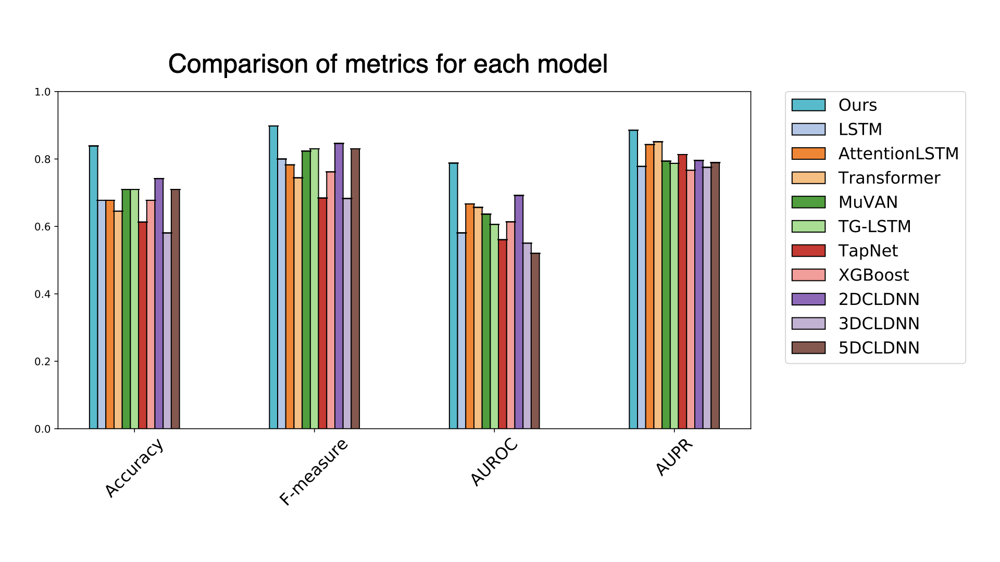

# NVAN :Normalized Multi-View Attention Network

This is the code for [Deep learning-based algorithm for predicting the live birth potential of mouse embryos](https://doi.org/10.1101/2021.08.19.456065).
This project is carried out in cooperation with [Funahashi Lab. at Keio University](https://fun.bio.keio.ac.jp/) and two labs: [Kobayashi Lab. at the University of Tokyo](http://research.crmind.net/) and Yamagata Lab. at Kindai University.


## Overview

Normalized Multi-View Attention Network (NVAN) performs the task of classification using multivariate time-series data as input.
An overview diagram of NVAN is shown below.
The multivariate time-series data in this project was obtained from images segmented by [QCANet](https://github.com/funalab/QCANet).


## Performance

The result of classification accuracy of multivariate time-series data using NVAN is shown below.
NVAN have succeeded in classifying embryos with high accuracy compared to methods that use various time series data for classification.




## Requirements

- [Python 3.6](https://www.python.org/downloads/)
- [PyTorch 1.5+](https://chainer.org/)
- [NumPy](http://www.numpy.org)
- [scikit-image](http://scikit-image.org/)
- [Matplotlib](https://matplotlib.org/)


## QuickStart

1. Download this repository by `git clone`.

   ```sh
   % git clone https://github.com/funalab/NVAN.git
   ```

2. Install requirements.

   ```sh
   % cd NVAN/
   % python -m venv venv
   % source ./venv/bin/activate
   % pip install -r requirements.txt
   ```

3. Inference on example test dataset.

   To run NVAN, follow the commands below.
   If you want to use a GPU, specify `cuda:[GPU ID]` (`cuda:0` if GPU ID is `0`) in device variable of `confs/models/test_best.cfg`.
   ```sh
   % ./scripts/run_test.sh
   ```

   After running the command, the results will be generated in the `results/test_NVAN_[time_stamp]` directory.
   `results/test_NVAN_[time_stamp]/log` is described in the classification accuracy of the inference.
   `results/test_NVAN_[time_stamp]/figs/` contains the generated graphs of AUROC/AUPR and attention map.
   By checking the attention map shown below, you can interpret which variates NVAN has focused on during inference.

   


## How to train and run NVAN

1. Train NVAN with example dataset

   Run the following command to train NVAN on the datasets/input_example dataset, which is time-series segmentation images acquired by QCANet into multivariate time series data.
   The training results will be generated in the `results/train_NVAN_example_[time_stamp]` directory.
   ```sh
   % ./scripts/run_train_example.sh
   ```

   The training conditions are described in `confs/models/train_example.cfg`.
   The details of the parameters are as follows.


    ```
    [Dataset]
    root_path                                   : Specify root directory path for training data.
    split_list_train                            : Specify the path of the file in which the input file name used for training is enumerated.
    split_list_validation                       : Specify the path of the file in which the input file name used for validation is enumerated.
    basename                                    : Specify the name of the directory where multivariate time series data is stored.

    [Model]
    model                                       : Specify model name {"NVAN"}.
    init_classifier                             : Initialize the classifier from given file.
    input_dim                                   : Specify dimensions of input multivariate.
    num_classes                                 : Specify number of label class. 
    num_layers                                  : Specify number of layers in LSTM.
    hidden_dim                                  : Specify number of hidden size in LSTM.
    base_ch                                     : Specify number of channels in convolution layer.
    dropout                                     : Specify the dropout rate for fully connected layers.
    lossfun                                     : Specify loss function.
    eval_metrics                                : Specify the metrics to be used to determine the convergence of learning.

    [Runtime]
    save_dir                                    : Specify output files directory where classification and model file will be stored.
    batchsize                                   : Specify minibatch size in training.
    val_batchsize                               : Specify minibatch size in validation.
    epoch                                       : Specify the number of sweeps over the dataset to train.
    optimizer                                   : Specify optimizer {"SGD", "Adadelta", "Adagrad", "Adam", "AdamW", "SparseAdam", "Adamax", "ASGD", "RMSprop"}.
    lr                                          : Specify initial learning rate for optimizer.
    momentum                                    : Specify momentum for optimizer.
    weight_decay                                : Specify weight decay (L2 norm) for optimizer.
    delete_tp                                   : Specify the number of time points to randomly delete the length of the input time series data. (parameter for augmentation in training.)
    device                                      : Specify "cpu" or "cuda:[GPU ID]" ("cuda:0" if GPU ID is "0")
    seed                                        : Specify the seed of the random number.
    phase                                       : Specify the phase {"train" or "test"}
    graph                                       : Specify `True` to generate a computational graph.
    ```

2. Run inference in trained NVAN

   The trained NVAN is `results/train_NVAN_example_[time_stamp]/best_model.npz`, which was generated in the previous step.
   Specify this file path as `init_classifier` in `confs/models/test_example.cfg`.
   After that, you can run the following command to infer the learned NVAN.

   ```sh
   % ./scripts/run_test_example.sh
   ```
   The results of the inference will be generated in the `results/test_NVAN_example_[time_stamp]` directory.


## References

- [Hochreiter, S. & Schmidhuber, J. Long short-term memory. Neural computation 9, 1735–1780 (1997).](https://ieeexplore.ieee.org/abstract/document/6795963)
- [Luong, M.-T., Pham, H. and Manning, C. D. Effective approaches to attention-based neural machine translation. EMNLP 2015, 1412-1421.](https://arxiv.org/abs/1508.04025)
- [Vaswani, A. et al. Attention is all you need. NeurIPS 2017, 6000-6010.](https://arxiv.org/abs/1706.03762)
- [Yuan, Ye, et al. MuVAN: A multi-view attention network for multivariate temporal data. ICDM 2018, 717-726.](https://ieeexplore.ieee.org/document/8594896)
- [Hu, J. & Zheng, W. Multistage attention network for multivariate time series prediction. Neurocomputing 383, 122–137 (2020).](https://www.sciencedirect.com/science/article/pii/S0925231219316625?via%3Dihub)
- [Zhang, X., Gao, Y., Lin, J. & Lu, C.-T. TapNet: Multivariate time series classification with attentional prototypical network. AAAI 2020, vol. 34, 6845–6852](https://ojs.aaai.org//index.php/AAAI/article/view/6165)
- [Chen, T. & Guestrin, C. XGBoost: A scalable tree boosting system. KDD 2016, 785–794](https://dl.acm.org/doi/10.1145/2939672.2939785)
- [Sainath, T. N., Vinyals, O., Senior, A. & Sak, H. Convolutional, long short-term memory, fully connected deep neural networks. ICASSP 2015, 4580–4584.](https://ieeexplore.ieee.org/document/7178838)


## Acknowledgement

The microscopic images used to generate multivariate time-series data
included in this repository is provided by Yamagata Lab., Kindai
University. The development of this algorithm was funded by JSPS
KAKENHI Grant Number 20H03244 and JST CREST Grant Number JPMJCR2011 to
[Akira Funahashi](https://github.com/funasoul) and JSPS KAKENHI Grant
Number 19J13189 to [Yuta Tokuoka](https://github.com/tokkuman).